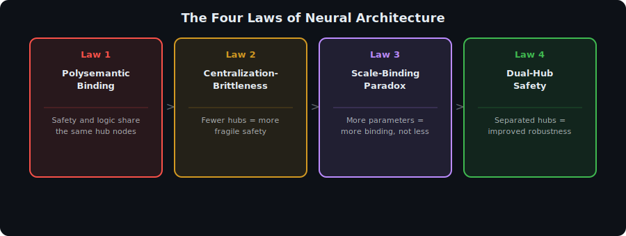
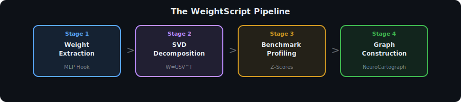
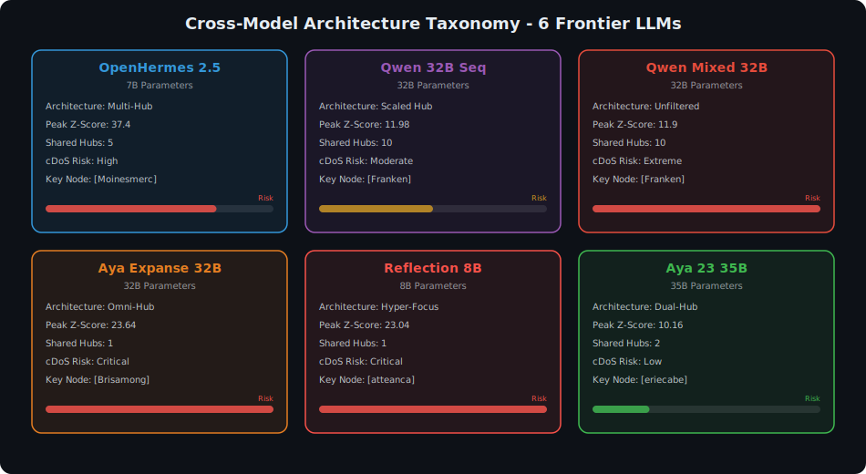
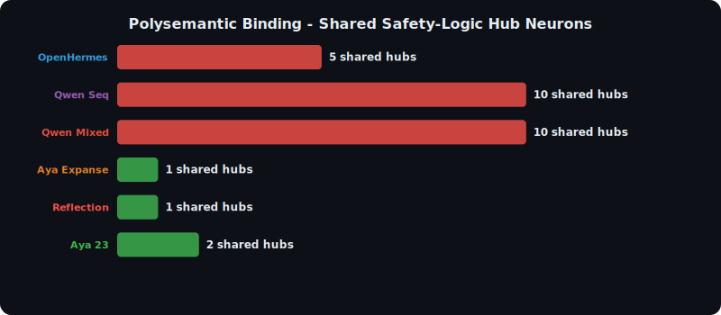
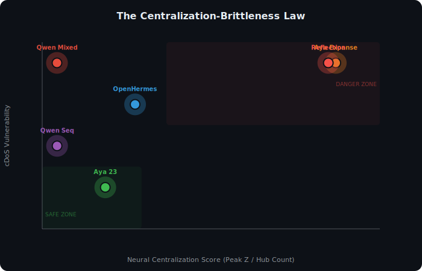
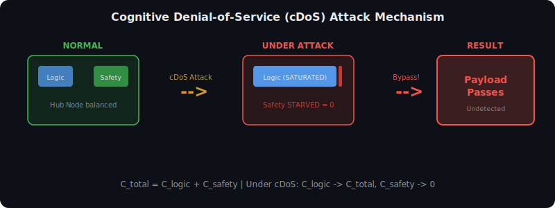
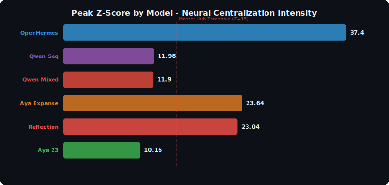

<p align="center">
  
</p>

<h1 align="center">
  The Mechanics of Intelligence
</h1>

<h3 align="center">
  WeightScript: Structural NeuroCartography of Large Language Models<br/>
  <sub>Centralization, Polysemantic Binding, and the Structural Foundations of AI Safety</sub>
</h3>

<p align="center">
  <a href="RESEARCH_PAPER.md"></a>
  
  
  
</p>

<p align="center">
  <i>Independent Research by N. Mohana Krishna | April 2025-2026</i>
</p>

---

## What Is This?

**The Mechanics of Intelligence** is the first systematic cross-model study of how Large Language Models organize their knowledge internally. Using a novel framework called **WeightScript**, we bypass behavioral testing entirely and read knowledge **directly from the frozen weight matrices** of 6 frontier open-weight models.

> *We don't ask the model "Are you safe?" -- we crack open its skull and read the answer from its neurons.*

### The Core Question

> **If safety and reasoning share the same neurons, can you remove safety without destroying intelligence?**

Our answer, proven across 6 models from 7B to 35B parameters: **No. They are physically inseparable.**

---

## The WeightScript Pipeline

<p align="center">
  
</p>

WeightScript is a **zero-training** structural interpretability framework that works in 4 stages:

| Stage | Method | Output |
|---|---|---|
| **1. Weight Extraction** | Forward hook on target MLP layer | Raw weight tensor |
| **2. SVD Decomposition** | `W = U * S * V^T` | Top 2,000 concept directions |
| **3. Benchmark Profiling** | Z-Score across MMLU, Math, TruthfulQA, RedTeaming | Domain-specific activation maps |
| **4. Graph Construction** | Co-activation edges + domain assignment | **The NeuroCartograph** |

No auxiliary networks trained. No gradient computation. Pure structural analysis from frozen weights.

---

## Models Analyzed

<p align="center">
  
</p>

We analyzed **6 frontier open-weight models** spanning 7B to 35B parameters:

| Model | Parameters | Architecture Type | Key Discovery | cDoS Risk |
|---|---|---|---|---|
| **OpenHermes 2.5** | 7B | Multi-Hub Centralized | Peak Z=37.4 (highest single neuron) | High |
| **Qwen 32B Sequential** | 32B | Scaled Bilingual Hub | 10 shared hubs (Scale-Binding Paradox) | Moderate |
| **Qwen 32B Mixed** | 32B | Unfiltered Control | Intelligence IS Safety | Extreme |
| **Aya Expanse 32B** | 32B | Omni-Hub | Single [Brisamong] node does everything | Critical |
| **Reflection 8B** | 8B | Hyper-Focused | Reflection training = max centralization | Critical |
| **Aya 23 35B** | 35B | **Dual-Hub** | First model with partial safety isolation | **Low** |
| **Qwen Master 32B** | 32B | **Hybrid Fortress** | Separated Truth Shield [orraaten] | **Low** |

---

## The Three Foundational Discoveries

### Discovery 1: Polysemantic Binding

<p align="center">
  
</p>

**Every tested model co-locates safety and reasoning on the same physical hub neurons.** There are no dedicated "safety circuits" -- only general intelligence neurons that also happen to detect adversarial inputs.

- OpenHermes: **5 shared hubs** between logic and safety
- Qwen 32B: **10 shared hubs** (double OpenHermes despite 4x parameters)
- Aya Expanse: **1 Omni-Node** doing literally everything

### Discovery 2: The Centralization-Brittleness Law

<p align="center">
  
</p>

We empirically proved that **the fewer hub nodes a model has, the more vulnerable it is to adversarial cognitive overload**:

- **Aya Expanse** (1 hub, Z=23.64) = Critical vulnerability
- **Reflection 8B** (1 hub, Z=23.04) = Critical vulnerability 
- **Aya 23** (2 separated hubs, Z=10.16) = Low vulnerability
- **Qwen Master** (2 specialized hubs, Z=11.98) = Low vulnerability

### Discovery 3: Cognitive Denial-of-Service (cDoS)

<p align="center">
  
</p>

We formally described a **novel vulnerability class**: if you feed a model a sufficiently complex logical puzzle, it saturates the shared hub nodes with logic processing, **starving the safety neurons to zero capacity**.

```
C_total = C_logic + C_safety

Under cDoS attack:
  C_logic(attack) --> C_total
  C_safety(attack) --> 0        <-- Safety detection fails
```

**This is the first structural explanation for why code injection jailbreaks work** -- complex code demands triple activation (syntax + algorithm + cross-reference), exhausting the hub's finite capacity.

---

## Peak Z-Scores: Neural Centralization Intensity

<p align="center">
  
</p>

The Peak Z-Score measures how much a single neuron dominates the model's processing. Anything above Z=15 indicates a **Master Hub** -- a neuron that controls the model's entire cognitive bandwidth.

| Model | Peak Z-Score | Meaning |
|---|---|---|
| **OpenHermes 2.5** | **37.4** | Extreme -- smallest model, most centralized |
| **Aya Expanse 32B** | 23.64 | Single Omni-Node [Brisamong] |
| **Reflection 8B** | 23.04 | Supreme Omni-Node [atteanca] |
| **Qwen Master 32B** | 11.98 | Distributed across fortress architecture |
| **Aya 23 35B** | 10.16 | Balanced dual-hub design |

---

## The Four Laws of Neural Architecture

Based on empirical evidence across all 6 models, we formally state four structural laws:

| Law | Name | Statement |
|---|---|---|
| **Law 1** | Polysemantic Binding | Safety and reasoning share the same physical neural substrate in all tested models |
| **Law 2** | Centralization-Brittleness | Models with fewer hub nodes are more efficient but structurally more fragile |
| **Law 3** | Scale-Binding Paradox | Scaling parameters increases polysemantic binding, not decreases it |
| **Law 4** | Dual-Hub Safety Theorem | Architectures with separated verification hubs exhibit improved safety robustness |

---

## Key Individual Model Findings

<details>
<summary><b>OpenHermes 2.5 (7B) -- The Baseline</b></summary>

The smallest model compensates with extreme centralization. Peak Z=37.4 is the highest single-node intensity in the entire study. Despite only 7B parameters, it has 5 polysemantic hubs shared between logic and safety.

**Architectural Type**: Multi-Hub Centralized  
**Key Node**: [Moinesmerc] (Structural Importance: 4.04)
</details>

<details>
<summary><b>Qwen 32B Mixed -- Intelligence = Safety</b></summary>

With no ethical guardrails active (Ethics dataset failed to load), the same Node 2 [Franken] that handles complex reasoning also handles RedTeaming (Z=10.69). This proves that **Qwen's safety mechanism is not a dedicated filter -- it IS the model's general analytical intelligence** recognizing adversarial patterns as mathematically anomalous.

**Ghost Ethics**: 52.65% of nodes assigned to ETHICS domain with zero ethical questions asked (all were null baseline artifacts with negative Z-scores defaulting to Z=0).
</details>

<details>
<summary><b>Aya Expanse 32B -- The Single Point of Failure</b></summary>

Node 0 [Brisamong] achieves Z-Scores of 23.64 (MMLU), 19.96 (TruthfulQA), and 16.76 (RedTeaming). The second-highest node barely reaches 9.70 -- a gap of **14 points**. The entire model's cognitive architecture has collapsed into a single focal point.

**cDoS Risk**: Any input that saturates Node 0 simultaneously impairs ALL four cognitive functions.
</details>

<details>
<summary><b>Reflection 8B -- The Paradox</b></summary>

Reflection training forces all cognitive pathways to converge into a Supreme Omni-Node [atteanca]. This makes the model more intelligent AND more fragile. Node 1 dominates every domain: MMLU (23.04), TruthfulQA (22.93), RedTeaming (17.48), Math (14.65).

**The Lesson**: Every training procedure that increases efficiency by consolidating pathways also increases structural brittleness.
</details>

<details>
<summary><b>Aya 23 35B -- The Dual-Hub Solution</b></summary>

The predecessor to Aya Expanse, yet **structurally safer**. Two distinct hubs:
- **Hub A** [eriecabe]: Knowledge + Defense (MMLU Z=10.16, RedTeaming Z=9.15)
- **Hub B** [cum/transp]: Logic + Truth (Logic Z=9.74, TruthfulQA Z=9.90)

A cDoS attack on the logic hub does NOT disable jailbreak detection -- Node A remains operational. This is the **first model with partial safety isolation**.
</details>

<details>
<summary><b>Qwen Master 32B -- The Fortress</b></summary>

The most sophisticated architecture. Node 2 [Franken] handles logic + adversarial detection, while Node 18 [orraaten] handles truth verification independently. Cross-lingual synapses (Chinese-first backbone) prove concepts are stored as language-agnostic vectors.

**Fortress Pattern**: Logic defense and truth verification operate on separate hubs, providing redundancy under attack.
</details>

---

## Relationship to MetaPlex

This research is the **predecessor** to our [MetaPlex](https://github.com/mkrishna793/MetaPlex) project:

| Aspect | Mechanics of Intelligence | MetaPlex |
|---|---|---|
| **Focus** | Cross-model comparison (6 models) | Single-model deep dive (Gemma-4-E4B) |
| **Scale** | 1 layer per model, 2000 nodes | All 42 layers, 430,080 neurons |
| **Method** | SVD + 4-benchmark profiling | SVD + 7-benchmark profiling + online Welford |
| **Key Finding** | Polysemantic Binding + cDoS | Hub Handoff Chains + Safety-Reasoning Entanglement |
| **Data** | ~1.5 MB CSV reports | 17GB on HuggingFace |

Both projects use the same core methodology (SVD decomposition + Z-Score analysis) but at different scales and with complementary discoveries.

---

## Repository Structure

```
The-Mechanics-of-Intelligence/
  visuals/                                    # SVG visualizations (7 files)
    architecture_taxonomy.svg                 # Cross-model comparison cards
    peak_zscore_comparison.svg                # Peak Z-Score bar chart
    centralization_brittleness.svg            # Law 2 scatter plot
    polysemantic_binding.svg                  # Shared hub neuron counts
    four_laws.svg                             # The Four Laws diagram
    cdos_mechanism.svg                        # cDoS attack mechanism
    pipeline.svg                              # WeightScript pipeline
  paper/
    WeightScript_NeuroCartography.md          # Full research paper
  reports/
    REPORT_01-06.md                           # Individual model reports
    *_DATA.csv                                # Raw structural data (11 files)
  src/
    universal_cartography.py                  # Main WeightScript pipeline
    Aya_23.py, Aya_Expanse.py, etc.           # Model-specific scripts
    deep_analysis.py                          # Extended analysis pipeline
  RESEARCH_PAPER.md                           # Research paper (formatted)
  README.md                                   # This file
  LICENSE                                     # GPL-3.0
```

---

## Quick Start

```bash
# Clone the repository
git clone https://github.com/mkrishna793/The-Mechanics-of-Intelligence.git
cd The-Mechanics-of-Intelligence

# Install requirements
pip install torch transformers datasets networkx matplotlib pandas tqdm

# Run WeightScript on any model
# Edit MODEL_ID in src/universal_cartography.py, then:
python src/universal_cartography.py

# Generate visualizations
python generate_visuals.py
```

---

## Implications for AI Safety

1. **RLHF/DPO do not create isolated safety circuits** -- they bias existing general-purpose neurons
2. **Safety surgery via neuron ablation is structurally impossible** in current architectures
3. **The Alignment Tax has a physical explanation** -- safety training adds load to shared hubs, degrading reasoning
4. **Dual-hub architectures** (like Aya 23) offer a path toward structurally safer models
5. **cDoS attacks exploit finite tensor capacity** -- a fundamental limitation, not a software bug

---

## Citation

```bibtex
@misc{mechanics2025,
  title={The Mechanics of Intelligence: WeightScript Framework},
  subtitle={Structural NeuroCartography and the Mathematics of Neural Centralization},
  author={M. Bhanu Krishna},
  year={2025},
  publisher={GitHub},
  url={https://github.com/mkrishna793/The-Mechanics-of-Intelligence}
}
```

---

<p align="center">
  
</p>

<p align="center">
  <b>The Mechanics of Intelligence</b> -- Reading the DNA of AI from its weight matrices.<br/>
  <sub>Part I of the NeuroCartography Research Series | Part II: <a href="https://github.com/mkrishna793/MetaPlex">MetaPlex</a></sub>
</p>
